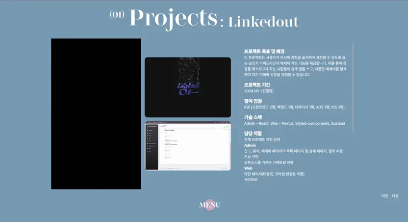
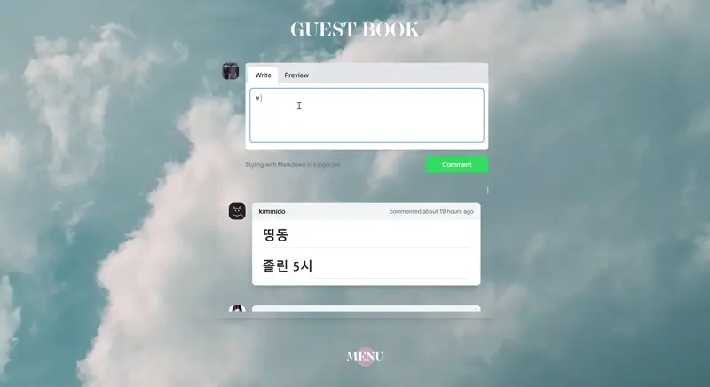

# PORTFOLIO

- 배포 URL : https://portpolio-gilt.vercel.app/

## 프로젝트 소개

개인 포트폴리오 프로젝트로, 프론트엔드 개발자로서의 기술과 경험을 보여주기 위해 제작한 웹사이트입니다.

## 페이지 및 기능

| 메인 페이지                                          | 소개 페이지                                           |
| ---------------------------------------------------- | ----------------------------------------------------- |
|  |  |

| 프로젝트 페이지                                             | 경험 페이지                                                |
| ----------------------------------------------------------- | ---------------------------------------------------------- |
|  |  |

| 방명록 페이지                                               |
| ----------------------------------------------------------- |
|  |

- Next.js와 Tailwind CSS를 사용한 반응형 웹사이트 구현
- Next-Auth를 이용한 GitHub 로그인 및 인증 시스템 구축 및 [블로그 게시글 작성](https://velog.io/@meek/Next-Auth)
- SSR(Server-Side Rendering)을 사용해 성능 최적화
- GSAP을 활용한 다양한 애니메이션 효과 구현으로 사용자의 시각적 경험 향상
- CI/CD 파이프라인 구축을 통한 자동 배포 설정 (Vercel 사용)
- SEO(Search Engine Optimization) 최적화를 통한 검색 엔진 가시성 향상

## 개발 환경

- Next.js, Tailwind, Next-auth, GSAP
- 버전 및 이슈관리 : Github, Github Issues, [Swagger](http://43.200.112.139:8080/swagger-ui/index.html)
- 서비스 배포 환경 : vercel

## 브랜치 전략

- GitHub-Flow 전략을 기반으로 main, develop 브랜치와 feature 보조 브랜치를 운용했습니다.
- main, develop, Feat 브랜치로 나누어 개발을 하였습니다.
  - main 브랜치는 배포 단계에서만 사용하는 브랜치입니다.
  - develop 브랜치는 개발 단계에서 GitHub-flow의 master 역할을 하는 브랜치입니다.
  - Feat 브랜치는 기능 단위로 독립적인 개발 환경을 위하여 사용하고 merge 후 각 브랜치를 삭제해주었습니다.

## 개발 시작

```
npm install
npm run dev
```
